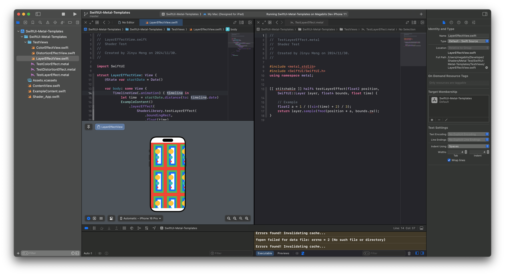

# SwiftUI Metal Starting Point
A template to kick start your SwiftUI Metal project.

This project aims to create an easy starting point for you to create your own Metal shader to use with SwiftUI.

It includes examples of the three main ways to use Shader with SwiftUI. You can learn the basics of shaders in SwiftUI from this project or experiment with your shaders.

While using this project, you can split the window with the view on one side and the shader on the other. After you modify the shader, you can click the view once to let it update the preview. Xcode won't update the preview if you only doing stuff in the shader part.

## This setup provides:

- Example graphics content: A material for you to preview the results.
- TimeLineView: Use to create animated shaders.
- Bounding box: A bounding box parameter is passed to shaders.

## The three SwiftUI shader APIs:

- ColorEffect: Use to modify the color of specific pixels. Should return half4(r, g, b, a), the new color of the pixel.
- DistortionEffect: Use to move specific pixels. Should return float2(x, y), the new absolute position of the pixel.
- LayerEffect: Use to sample on any position of the layer to get its color as the new color of the pixel. Use `layer.sample(float2 position);` to sample on position. Should return half4(r, g, b, a), the new color of the pixel.

Combining these APIs, you can create stunning graphics in your SwiftUI view without the complex setup of Metal.